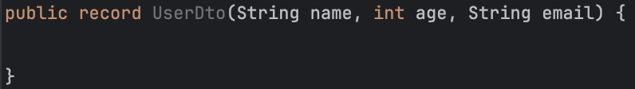

## DTO(Data Transfer Object)란?

Data Transfer Object를 직역하면 데이터 전송 객체이다. 이름부터 그 역할을 쉽게 추측할 수 있다.
아래는 DTO에 대한 정의 및 설명이다.

> In the field of programming a **data transfer object (DTO)** is an object that carries data between processes.
> [...] DTO does not have any behavior except for storage, retrieval, serialization and deserialization of its own data
> (mutators, accessors, serializers and parsers).
> In other words, DTOs are simple objects that should not contain any business logic but may contain serialization and
> deserialization mechanisms for transferring data over the wire.
>
> **[번역]** 프로그래밍 분야에서 **데이터 전송 객체(Data Transfer Object, DTO)**는 프로세스 간에 데이터를 전달하는 객체입니다.
> […] DTO는 자신의 데이터 저장, 검색, 직렬화 및 역직렬화 외에는 어떤 동작도 하지 않습니다(변경자, 접근자, 직렬화기 및 파서).
> 다시 말해, DTO는 비즈니스 로직을 포함해서는 안 되는 간단한 객체이며, 데이터를 전송하기 위한 직렬화 및 역직렬화 메커니즘을 포함할 수 있습니다.

DTO는 계층(Layer) 간 데이터 교환을 위해 사용하는 객체이다.
웹 애플리케이션에서는 주로 다음과 같은 상황에서 사용된다:

- 클라이언트와 서버 간의 테이터 전송 (HTTP 통신)
- 애플리케이션 내부 계층 간 데이터 전달
- 외부 시스템과의 데이터 교환

즉, DTO는 순수하게 데이터를 담아 전달하는 것이 목적이며 비즈니스 로직을 포함하지 않는 단순한 데이터 컨테이너이다.

아래는 사용자 정보를 담은 간단한 `UserDto`이다.

```java
@Getter
@RequiredArgsConstructor
public class UserDto {

    private final String name;
    private final int age;
    private final String email;

    // TODO: toString, equals, hashCode
}

```

Spring 프레임워크에서 DTO는 직렬화/역직렬화를 통해 각 계층에 맞는 데이터 형식으로 변환된다.

- 요청 (JSON → DTO)
  - HTTP 요청의 JSON 데이터를 자동으로 Java 객체로 변환
  - `@RequestBody` 애너테이션이 이를 처리
- 응답 (DTO → JSON)
  - 반환되는 Java 객체를 자동으로 JSON으로 변환
  - `@RestController` 또는 `@ResponseBody` 애너테이션이 이를 처리

## Record란?

Java 16에서는 불변(Immutable) 데이터 객체를 더 쉽게 만들 수 있는 Record라는 새로운 기능이 추가되었다.
Record를 사용하면 위의 `UserDto`를 다음과 같이 간단하게 작성할 수 있다:

```java
public record UserDto(String name, int age, String email) {

}
```

실제로도 IDE에서는 위 코드를 Record로 대체할 것을 권장한다.


IDE가 제안하는 `Convert to a record`를 클릭하면 아래처럼 Record로 변환됨을 확인할 수 있다.



## DTO를 Record로 구현해야 하는 이유

그렇다면 DTO를 Record로 구현해야 하는 이유가 무엇일까?
일단 이전 코드를 통해 확실히 코드가 짧아지는 것을 알 수 있다.
일반 클래스 DTO를 Record로 변환하면서 사라지는 것들이 있다.

- 접근제어자 (`private final`)
- 생성자 (`@RequiredArgsConstructor`)
- Boilerplate 코드 (Getter, `toString`, `equals`, `hashCode`)

### Record와 접근제어자 (`private final`)

DTO의 핵심은 계층 간 데이터 전송을 담당한다는 것이다.
이 과정에서 가장 중요한 점은 전송 과정에서 데이터가 의도치 않게 변경되면 안 된다는 것이다.
그렇기 때문에 DTO는 자신의 필드를 변경할 수 없도록 `private final`로 선언한다.

- `private`: 외부에서 직접 필드 접근을 막아 캡슐화를 보장
- `final`: 객체 생성 후 데이터 변경을 막아 불변성을 보장

Record는 이러한 DTO의 필수 요구사항을 기본적으로 충족한다.
Record의 모든 필드는 자동으로 `private final`으로 선언되어 데이터의 안전한 전송을 보장한다.

### Record와 생성자

DTO는 여러 데이터를 한 번에 전달하기 위한 객체다.
따라서 모든 필드를 초기화하는 생성자가 필요하다:

- 필수 데이터 누락 방지
- 객체 생성 시점에 모든 데이터 초기화
- 불변성 보장을 위한 final 필드 초기화

Record는 선언된 필드들을 매개변수로 받는 Canonical 생성자를 자동으로 생성한다.
이는 Lombok의 `@RequiredArgsConstructor`가 하는 일을 더 간결하게 처리한다.

### Record와 Boilerplate 코드

DTO에 아래 메서드들이 필요한 이유가 있다:

- Getter: 캡슐화된 데이터에 접근하기 위한 표준 방식 제공
- `toString()`: 디버깅과 로깅을 위한 객체 상태 확인
- `equals()`: 두 DTO 객체가 같은 데이터를 가지고 있는지 비교
- `hashCode()`: `HashSet`, `HashMap` 등의 컬렉션에서 정상적으로 동작하기 위해 필요

이러한 메서드들은 DTO가 제대로 동작하기 위해 반드시 필요하지만, 작성하기 번거롭고 실수하기 쉽다.
Record는 이 모든 메서드를 자동으로 올바르게 구현해주므로, 개발자는 실수 없이 DTO의 핵심 목적인 데이터 정의에만 집중할 수 있다는 장점이 있다.

따라서 Record는 단순히 코드를 줄이는 것이 아니라, DTO가 갖춰야 할 모든 필수 요소를 자동으로 제공하면서도 더 안전하고 명확한 방식으로 구현할 수 있게 해준다는 것을 알 수 있다.

## 모든 Record가 DTO인 것은 아니다

그렇다면 Record로 구현된 객체는 모두 DTO의 역할을 하는가?
그것은 아니다.
Record의 기능은 불변 데이터를 캡슐화하는 것이기 때문에 DTO 외에도 VO(Value Object)의 역할도 수행할 수 있다.
VO는 도메인 모델 내에서 특정 값을 표현하는 객체로 사용되며 비즈니스 로직을 포함할 수 있다는 점에서 DTO와 다르다.

## Record의 한계

Record는 DTO를 구현할 때 많은 장점을 제공하지만, 몇 가지 중요한 한계점도 가지고 있다.
Record를 사용하기 전에 이러한 제약사항들을 잘 이해하고 있어야 한다.

### 상속 불가능

Record는 다른 클래스를 상속받을 수 없고, Record끼리도 상속이 불가능하다. 단, 인터페이스 구현은 가능다.

```java
// 불가능한 상속 예시
public record EmployeeRecord(String name, int id) extends PersonRecord { } // 컴파일 에러

// 가능한 인터페이스 구현
public record UserRecord(String name, String email) implements Serializable { }
```

이는 Record가 순수하게 데이터를 보관하고 전달하는 역할만을 수행하도록 설계되었기 때문이다.

### 제한된 필드 선언

Record의 모든 필드는 final이며, 추가로 인스턴스 필드를 선언할 수 없다. 오직 static 필드만 추가할 수 있다.

```java
public record ProductRecord(String name, int price) {

    private int stock; // 컴파일 에러: 인스턴스 필드 선언 불가
    private static final String CATEGORY = "PRODUCT"; // OK: static 필드는 가능
}
```

이러한 제약은 Record의 불변성을 보장하기 위한 것이지만, 때로는 개발의 유연성을 제한할 수 있다.

### Java 버전 제약

Record는 Java 16부터 도입된 기능이다.
따라서 이전 버전의 Java를 사용하는 프로젝트에서는 Record를 사용할 수 없다.
레거시 시스템을 유지보수하거나, 이전 버전의 Java를 사용해야 하는 환경에서는 기존의 클래스 기반 DTO를 사용해야 한다.
