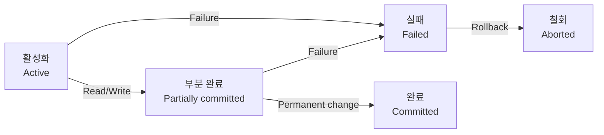

## **DB 부분 성공/실패 시나리오**

당신은 은행 송금 시스템을 개발하고 있다.
한 계좌에서 다른 계좌로 송금할 때, 다음 두 가지 작업이 순차적으로 이루어진다:

1. 출금 계좌에서 금액 차감
2. 입금 계좌에 금액 추가

어느날, 다음과 같은 상황이 발생했다:

> A 계좌에서 B 계좌로 10만원을 송금하던 중,
> A 계좌에서 금액이 차감된 후,
> 네트워크 오류로 인해 B 계좌에 금액이 입금되지 않았다.

결과적으로 출금은 이루어졌지만 입금은 되지 않아, 10만원이 증발해 버렸다.
이러한 문제는 고객의 신뢰를 심각하게 훼손한다.

## **try-catch 예외 처리**

오류가 발생했을 때, 가장 첫 번째로 떠오르는 것은 예외 처리이다.
위 상황을 해결하기 위해 개발자는 가능한 모든 예외를 처리하는 복잡한 코드를 작성해야 한다:

```java
@RequiredArgsConstructor
@Service
public class BankingService {
    
    private final AccountRepository accountRepository;

    public void transfer(String fromId, String toId, BigDecimal amount) {
        Account fromAccount;

        try {
            // 출금 계좌 조회 및 금액 차감
            fromAccount = accountRepository.findById(fromId)
                .orElseThrow(() -> new AccountNotFoundException("Account not found"));
            fromAccount.validateBalanceGreaterThan(amount);
            fromAccount.withdraw(amount);
            accountRepository.save(fromAccount);

            try {
                // 입금 계좌 조회 및 금액 추가
                Account toAccount = accountRepository.findById(toId)
                    .orElseThrow(() -> new AccountNotFoundException("Account not found"));
                toAccount.deposit(amount);
                accountRepository.save(toAccount);
            } catch (Exception e) {
                // 입금 실패 시 출금 취소
                fromAccount.deposit(amount);
                accountRepository.save(fromAccount);
                throw new TransferExcpetion("Transfer failed: " + e.getMessage(), e);
            }
        } catch (Exception e) {
            throw new TransferExcpetion("Transfer failed: " + e.getMessage(), e);
        }
    }
}
```

중첩된 try-catch 문으로 실패 시 예외 처리를 구현했다.
이 방법은 여러가지 문제점이 있다.

- **가독성 저하**: 중첩된 구문으로 인해 코드가 복잡함
- **비즈니스 로직 불명확**: 예외 처리 코드가 많아 핵심 비즈니스 로직을 이해하기 어려움
- **불완전한 롤백**: 롤백 과정에서 또 다른 예외가 발생하면 처리하지 못 함
- **동시성 문제**: 해당 작업이 원자적임을 보장할 수 없음

## **트랜잭션(Transaction)**

이런 상황에서 필요한 것이 바로 **트랜잭션**이다.
<u>트랜잭션은 DB의 상태를 변화시키는 하나의 논리적 작업 단위</u>이다.
여러 개의 작업을 마치 하나의 작업처럼 처리하여, 모든 작업이 성공적으로 완료되거나 아니면 전혀 실행되지 않은 상태로 유지되도록 보장한다.

간단한 예시로 은행 계좌 간 송금을 생각해보자:

1. A 계좌에서 10만원 출금
2. B 계좌에 10만원 입금

이 두 작업은 반드시 함께 성공하거나 함께 실패해야 한다.
만약 첫 번째 작업만 성공하고 두 번째 작업은 실패한다면 매우 심각한 문제가 발생한다.
트랜잭션은 이러한 상황을 방지하기 위해 존재한다.

### **트랜잭션의 연산 과정**

트랜잭션은 다음과 같은 주요 연산을 통해 처리된다:

1. 트랜잭션 시작
   - 트랜잭션 연산을 시작함
   - 이 시점부터 모든 DB 변경사항은 트랜잭션의 일부로 추적됨
2. 읽기/쓰기 작업
   - 트랜잭션 내의 DML SQL 문이 실행됨
   - 이 시점에서 변경된 데이터는 아직 DB에 반영되지 않음
   - 변경사항은 버퍼나 로그에 기록
3. 커밋 (Commit)
   - 트랜잭션의 모든 변경사항을 영구적으로 DB에 반영
   - 트랜잭션 종료
4. 롤백 (Rollback)
   - 트랜잭션의 모든 변경사항을 취소하고 이전 상태로 되돌림
   - 트랜잭션 종료
5. 저장점 (Savepoint)
   - 트랜잭션 내에서 중간 지점 표시
   - 해당 지점까지 롤백 가능

### **트랜잭션 상태**

트랜잭션은 다음과 같은 상태를 거친다:

1. Active(활성): 트랜잭션이 시작되어 실행 중인 상태
2. Failed(실패): 오류가 발생하여 트랜잭션이 실행될 수 없는 상태
3. Partially Committed(부분 완료): 마지막 작업이 실행된 후 커밋 전 상태
4. Committed(완료): 트랜잭션이 성공적으로 완료된 상태
5. Aborted(철회): 트랜잭션이 롤백되고 DB가 원 상태로 돌아간 상태



### **JDBC 트랜잭션**

위에서 try-catch 문으로 예외 처리했던 코드를 JDBC를 이용하여 트랜잭션을 적용하면 다음과 같다:

```java
@RequiredArgsConstructor
@Service
public class BankingService {
    
    private final DataSource dataSource;
    private final AccountRepository accountRepository;

    public void transfer(String fromId, String toId, BigDecimal amount) {
        try (Connection connection = dataSource.getConnection()) {
            connection.setAutoCommit(false); // 트랜잭션 시작

            try {
                // 출금 계좌 조회 및 금액 차감
                Account fromAccount = accountRepository.findById(fromId, connection)
                    .orElseThrow(() -> new AccountNotFoundException("Account not found"));
                fromAccount.validateBalanceGreaterThan(amount);
                fromAccount.withdraw(amount);
                accountRepository.save(fromAccount, connection);

                // 입금 계좌 조회 및 금액 추가
                Account toAccount = accountRepository.findById(toId, connection)
                    .orElseThrow(() -> new AccountNotFoundException("Account not found"));
                toAccount.deposit(amount);
                accountRepository.save(toAccount, connection);

                // 모든 작업이 성공하면 커밋
                connection.commit();
            } catch (Exception e) {
                // 예외 발생 시 롤백
                connection.rollback();
                throw new TransferException("Transfer failed: " + e.getMessage(), e);
            }
        } catch (Exception e) {
            throw new TransferException("Database connection failed: " + e.getMessage(), e);
        }
    }
}
```

JDBC 트랜잭션은 `Connection` 객체를 통해 직접 제어된다. 위 코드의 주요 특징은 다음과 같다:

1. 트랜잭션 시작: `connection.setAutoCommit(false)`를 호출하여 자동 커밋을 비활성화한다.
   이 시점부터 모든 SQL 문은 명시적으로 커밋하기 전까지 트랜잭션의 일부로 간주된다.
2. 트랜잭션 범위: try-with-resources 블록으로 `Connection`의 생명주기를 관리하여 트랜잭션 범위를 명확히 한다.
3. 작업 수행: 트랜잭션 내에서 여러 DB 작업을 수행한다. 이 작업들은 모두 같은 `Connection` 객체를 사용하므로 동일한 트랜잭션에 속한다.
4. 불변식 검사: 비즈니스 규칙(잔액이 출금액보다 커야 함)을 검사하여 데이터 일관성을 보장한다.
5. 커밋: 모든 작업이 성공적으로 완료되면 `connection.commit()`을 호출하여 변경사항을 DB에 영구적으로 반영한다.
6. 롤백: 예외가 발생하면 `connection.rollback()`을 호출하여 모든 변경사항을 취소한다.
7. 리소스 정리: try-with-resources 구문으로 `Connection`이 자동으로 닫힌다.

이 방식의 장점은 원자성을 보장하여 모든 작업이 성공하거나 모두 실패하도록 하는 것이다.
특히 계좌 이체와 같이 여러 작업이 하나의 논리적 단위로 처리되어야 하는 경우에 매우 중요하다.

## **ACID 원칙: 트랜잭션의 네 가지 핵심**

ACID는 데이터베이스 트랜잭션이 안전하게 수행된다는 것을 보장하기 위한 네 가지 속성의 두문자어(Acronym)이다.
다음으로는 ACID의 각 속성을 알아보겠다.

### **원자성(Atomicity)**

> **(All or Nothing)** 트랜잭션의 모든 작업은 전부 성공하거나 전부 실패해야 한다. 부분적 성공은 허용되지 않는다.

원자성은 분할할 수 없는 특성을 의미한다.
트랙잭션이 DB에 반영될 때는 해당 트랜잭션 내의 모든 연산이 성공적으로 완료되었을 때만 반영되며,
하나라도 실패하면 전체가 취소된다.

### **일관성(Consistency)**

> 트랜잭션이 완료된 후에도 데이터베이스는 일관된 상태를 유지해야 한다. 모든 데이터는 정의된 규칙과 제약조건을 만족해야 한다.

일관성은 트랜잭션 전후로 DB가 모든 무결성 제약조건을 만족하는 상태를 유지해야 함을 의미한다. 예를 들면:

- 기본 키 제약조건 (PRIMARY KEY Constraint)
- 참조 무결선 제약조건 (FOREIGN KEY Constraint)
- NOT NULL 제약조건
- 고유성 제약조건 (UNIQUE Constraint)

### **격리성(Isolation)**

> 동시에 실행되는 트랜잭션들은 서로 영향을 미치지 않아야 한다. 각 트랜잭션은 다른 트랜잭션의 중간 상태를 볼 수 없어야 한다.

격리성은 여러 트랜잭션이 동시에 실행될 때 서로 간섭하지 않도록 보장한다.
이상적으로는 각 트랜잭션이 순차적으로 실행되는 것처럼 동작해야 한다.

#### **격리 수준**

DB는 일반적으로 네 가지 격리 수준을 제공한다:

- **READ UNCOMMITTED**: 가장 낮은 격리 수준으로, 커밋되지 않은 변경사항도 다른 트랜잭션에서 볼 수 있음
- **READ COMMITTED**: 커밋된 데이터만 읽을 수 있음
- **REPEATABLE READ**: 트랜잭션 내에서 동일한 조회를 여러번 실행해도 항상 같은 결과 보장
- **SERIALIZABLE**: 완벽한 격리를 제공하지만 성능 저하 발생

#### **동시성 문제**

격리성이 보장되지 않으면 다음과 같은 문제가 발생할 수 있다:

- **Dirty Read**: 커밋되지 않은 데이터를 읽는 문제
- **Non-Repeatable Read**: 동일한 조회를 반복할 때 다른 트랜잭션의 수정으로 다른 결과가 나오는 문제
- **Phantom Read**: 트랜잭션 실행 중 다른 트랜잭션의 삽입/삭제로 결과 집합이 변경되는 문제

### **지속성(Durability)**

> 트랜잭션이 성공적으로 완료(커밋)된 후에는 시스템 장애가 발생하더라도 그 결과가 영구적으로 보존되어야 한다.

지속정은 커밋된 트랜잭션의 결과가 영구적으로 저장됨을 보장한다.
이는 시스템 충돌, 정전, 기타 장애가 발생하더라도 데이터가 손실되지 않음을 의미한다.

## **트랜잭션 관리의 실제 구현**

### **Spring Framework에서의 트랜잭션 관리**

위에서는 JDBC를 직접 사용하여 트랜잭션을 관리했다.
JDBC는 저수준(low-level) API로 트랜잭션을 명시적으로 직접 관리한다.
심지어 개발자가 리소스(`Connection`) 관리까지 담당해야 한다.

스프링은 선언적 트랜잭션 관리를 제공하여 개발자가 쉽게 트랜잭션을 사용할 수 있도록 지원한다.
스프링 프레임워크는 `@Transactional` 애너테이션을 제공하여 트랜잭션을 자동으로 관리한다.
이는 고수준(high-level) API로 개발자는 비즈니스 로직에만 집중할 수 있도록 한다.
실제 대부분의 구현으로는 이 선언적 방식을 사용한다.

```java
@RequiredArgsConstructor
@Service
public BankingService {
    
    private final AccountRepository accountRepository;

    @Transactional
    public void transfer(String fromAccount, String toAccount, BigDecimal amount) {
        // 출금 계좌 조회 및 금액 차감
        Account fromAccount = accountRepository.findById(fromId)
            .orElseThrow(() -> new AccountNotFoundException("Account not found"));
        fromAccount.validateBalanceGreaterThan(amount);
        fromAccount.withdraw(amount);
        accountRepository.save(fromAccount);

        // 입금 계좌 조회 및 금액 추가
        Account toAccount = accountRepository.findById(toId)
            .orElseThrow(() -> new AccountNotFoundException("Account not found"));
        toAccount.deposit(amount);
        accountRepository.save(toAccount);
    }
}
```

### **트랜잭션 속성 설정**

스프링은 `@Transactional` 애너테이션에 다양한 속성을 설정할 수 있다:

```java
@Transactional(
    propagation = Propagation.REQUIRED,
    isolation = Isolation.READ_COMMITED,
    timeout = 30,
    readOnly = false,
    rollbackFor = Exception.class,
    noRollbackFor = NotFoundException.class
)
public void transfer(String fromId, String toId, BigDecimal amount) {
    ...
}
```

1. 전파 속성 (Propagation)
   - `REQUIRED`: 기존 트랜잭션이 있으면 참여, 없으면 새로 생성 (Default)
   - `REQUIRES_NEW`: 항상 새 트랜잭션 생성
   - `NESTED`: 기존 트랜잭션 내 중첩 트랜잭션 생성
   - `SUPPORTS`: 기존 트랜잭션이 있으면 참여, 없으면 트랜잭션 없이 실행
   - `NOT_SUPPORTED`: 트랜잭션 없이 실행, 기존 트랜잭션은 일시 중단
   - `NEVER`: 트랜잭션 없이 실행, 기존 트랜잭션이 있으면 예외 발생
   - `MANDATORY`: 기존 트랜잭션이 있어야 함, 없으면 예외 발생
2. 격리 수준 (Isolation)
   - `DEFAULT`: DB가 제공하는 기본 격리 수준 사용
   - `READ_UNCOMMITTED`: 커밋되지 않은 데이터 조회 가능
   - `READ_COMMITTED`: 커밋된 데이터만 조회 가능
   - `REPEATABLE_READ`: 트랜잭션 내 컬럼 조회 시 항상 같은 결과 반환
   - `SERIALIZABLE`: 완전한 격리를 제공하여 동일 결과 집합 반환
3. timeout: 트랜잭션 제한 시간(초)
   - 장시간 리소스 점유 및 데드락 방지
   - `TransactionTimedOutException` 발생 및 롤백
4. readOnly: 읽기 전용 트랜잭션 여부 (최적화 용도)
   - 변경 감지(Dirty Checking)를 수행하지 않음
   - 읽기 전용 트랜잭션은 Write 락을 획득하지 않음
   - 개발자에게 해당 메서드가 데이터를 변경하지 않음을 명시적으로 알림
5. rollbackFor/noRollbackFor: 특정 예외에 대한 롤백 정책 설정

## **결론: 트랜잭션과 ACID의 중요성**

트랜잭션과 ACID 원칙은 <u>데이터베이스의 무결성과 일관성을 보장하는 핵심 개념</u>이다.
특히 금융 거래, 예약 시스템, 재고 관리 등 데이터 정확성이 중요한 애플리케이션에서는 필수적이다.
트랜잭션을 올바르게 관리하면:

- **사용자 신뢰 확보**: 모든 작업이 완료되거나 전혀 수행되지 않음을 보장하여 데이터 일관성 유지
- **개발 복잡성 감소**: 개발자가 예외 상황과 롤백을 일일이 처리하지 않아도 됨
- **동시성 제어**: 여러 사용자가 동시에 시스템을 사용해도 데이터 일관성 유지
- **시스템 복원력**: 장애 발생 후에도 데이터베이스를 일관된 상태로 복구 가능

트랜잭션을 올바르게 이해하고 적용하는 것은 안정적이고 신뢰할 수 있는 시스템을 구축하는 핵심 단계이다.
